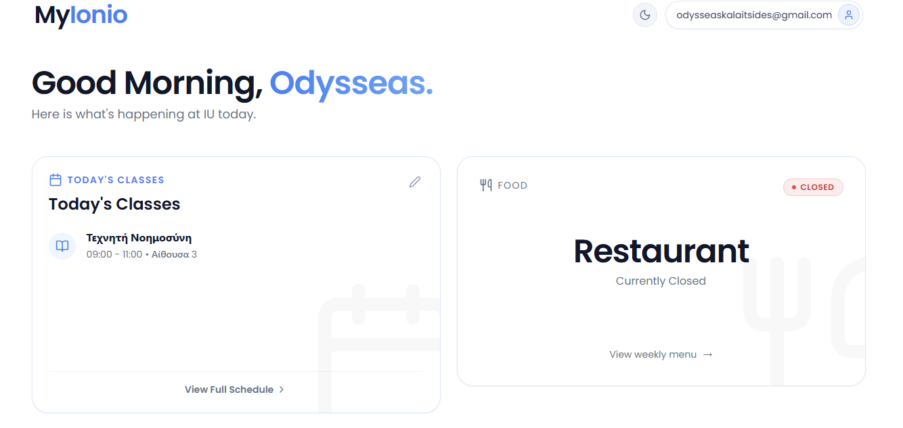
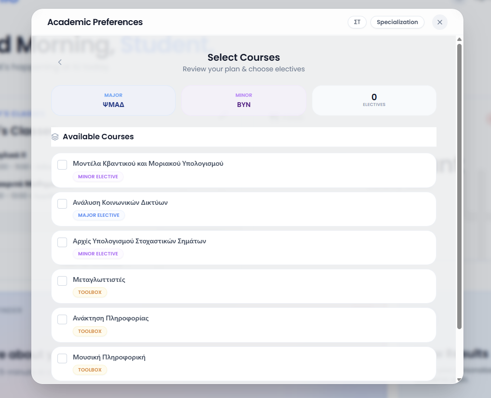

# 🎓 MyIonio Monorepo

[](LICENSE)
[](Frontend/)
[](Backend/)
[](docker-compose.yml)
[]( .github/workflows/deploy.yml)

**MyIonio** is a premium, full-stack academic platform designed for the Ionian University community. It streamlines the student experience through intelligent course recommendations, real-time schedule management, and a high-performance, containerized infrastructure.

---

## 📸 Preview

<p align="center">
  
  
</p>
<p align="center">
  
  
</p>

---

## ✨ Key Features

- 🚀 **Intelligent Dashboard**: At-a-glance view of today's classes, campus services, and restaurant status.
- 👨‍🏫 **Professor Directory**: Comprehensive searchable database of faculty members with full weekly academic programs.
- 🎯 **Academic Preferences**: Smart semester and course selection flow tailored to individual academic paths.
- 📅 **Interactive Schedules**: Weekly schedules with real-time filtering by day, department, and semester.
- 🌓 **Adaptive UI**: Premium dark/light mode support with smooth Framer Motion transitions.

---

## 🛠️ Technology Stack

### **Frontend**
- **React 19** with **TypeScript** for type-safe UI development.
- **Tailwind CSS** for a modern, utility-first responsive design.
- **Framer Motion** for premium micro-interactions and transitions.
- **Redux Toolkit** for robust state management.
- **Lucide React** for consistent, high-quality iconography.

### **Backend**
- **ASP.NET Core 8.0 Web API** following RESTful principles.
- **Entity Framework Core** with **PostgreSQL** for reliable data persistence.
- **JWT Authentication** with Secure Cookie storage for protected resource access.
- **Centralized Exception Handling** for consistent API error responses.
- **Rate Limiting** to protect against brute-force and resource exhaustion.

### **DevOps & Infrastructure**
- **Docker & Docker Compose** for absolute environment parity across Dev and Production.
- **GitHub Actions** for a fully automated CI/CD pipeline targeting an Ubuntu VPS.
- **Nginx Reverse Proxy** for efficient traffic routing and SSL termination.

---

## 🏗️ Architecture & Best Practices

This project is built as a **Monorepo**, ensuring seamless integration between the frontend and backend. 
- **Decoupled Design**: Heavy use of **DTOs** (Data Transfer Objects) and **Interfaces** to ensure the frontend and backend can evolve independently.
- **Security First**: Implements JWT-based auth, CORS policies, and secure headers.
- **DevOps Parity**: The same `docker-compose` configuration is used for both local development and production deployment, minimizing "it works on my machine" issues.

---

## 🚀 Getting Started

### Prerequisites
- [Docker & Docker Compose](https://docs.docker.com/get-docker/)
- [.NET 8.0 SDK](https://dotnet.microsoft.com/download/dotnet/8.0)
- [Node.js 20.x](https://nodejs.org/)

### Local Setup
1. Clone the repository.
2. Setup environment variables:
   ```bash
   cp .env.example .env
   ```
3. Spin up the entire stack:
   ```bash
   docker compose up -d --build
   ```
4. Access the apps:
   - **Frontend**: `http://localhost:8080`
   - **Backend API**: `http://localhost:5000/swagger`

---

## 🚢 Deployment

Automated deployment is handled via **GitHub Actions**. Upon every push to the `master` branch:
1. The codebase is checked out.
2. A secure SSH connection is established with the VPS.
3. The latest code is pulled and containers are rebuilt seamlessly.
4. Old images are pruned to maintain server health.

---

## 📝 License
Distributed under the **MIT License**. See `LICENSE` for more information.

---

<p align="center">
  Developed with ❤️ for the Ionian University Community.
</p>
