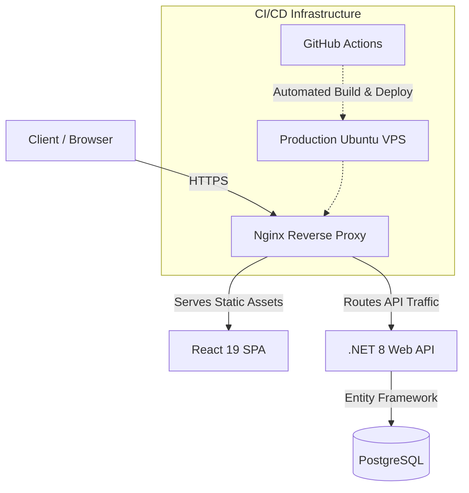

# MyIonio Monorepo

MyIonio is a full-stack, containerized academic platform engineered for the Ionian University student body. It supports a growing user base of over 4,000 university students by providing real-time schedule management, academic profiling, and intelligent course recommendations. Engineered from the ground up as a solo-developed platform, the project features a fully custom-built end-to-end architecture encompassing the frontend React application, the .NET Core backend API, the relational database structure, and the automated CI/CD deployment pipelines.

## Technology Stack

The platform is built upon a modern, high-performance tech stack designed for scalability, type safety, and maintainability:

*   **Frontend**: React 19, TypeScript, Tailwind CSS, Redux Toolkit
*   **Backend**: ASP.NET Core 8.0 Web API, Entity Framework Core
*   **Database**: PostgreSQL
*   **DevOps & Infrastructure**: Docker, Docker Compose, GitHub Actions, Nginx Reverse Proxy
*   **Security**: JWT-based Authentication with HTTP-only Cookies

## Architecture Overview

The system utilizes a decoupled monorepo architecture. The frontend SPA communicates with a robust .NET Web API, which manages data persistence via Entity Framework Core connected to a PostgreSQL database. The entire stack is fully containerized using Docker, ensuring absolute environment parity between local development and the production server.



## Developer Ownership

As a solo-engineered platform, core technical responsibilities and implementations span the entire development lifecycle:

*   **System Architecture**: Design of the decoupled architecture, RESTful API contracts, and normalized PostgreSQL database schemas.
*   **Frontend Engineering**: Development of a responsive, accessible, and highly interactive user interface focused on performance and modern UX principles.
*   **Backend Development**: Implementation of secure APIs, centralized exception handling, business logic, and efficient data access patterns in C#/.NET 8.
*   **DevOps & CI/CD**: Containerization of all services using Docker and engineering of automated GitHub Actions workflows for seamless, zero-downtime deployments to a Linux VPS.
*   **Quality & Security**: Enforcement of code quality standards, implementation of rate limiting, and security hardening against common web vulnerabilities.

## Getting Started

### Local Environment Setup

To run the application locally, ensure you have Docker and Docker Compose installed.

1.  Clone the repository.
2.  Copy `.env.example` to `.env` and configure the necessary environment variables.
3.  Launch the containerized environment:

```bash
docker compose up -d --build
```

The frontend application will be accessible at `http://localhost:8080`, and the backend API documentation (Swagger) can be found at `http://localhost:5000/swagger`.

## License

This project is distributed under the MIT License.
