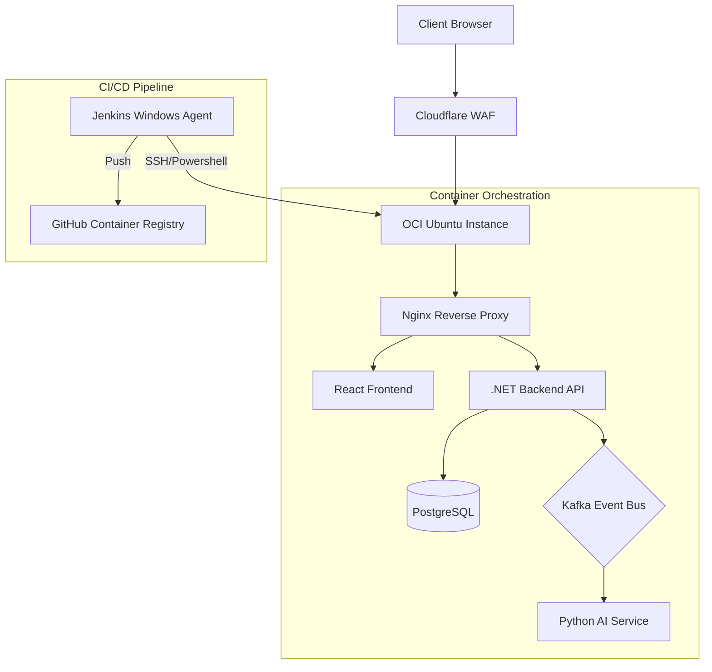

# MyIonio Monorepo

MyIonio is a containerized microservices platform engineered for academic management at Ionian University. The system automates real-time schedule management and academic profiling for a user base of approximately 4,000 students. The platform is built with a decoupled architecture to ensure independent scalability of the frontend, backend, and data processing layers.

## Preview

<p align="center">
  
  
</p>
<p align="center">
  
  
</p>

## Technical Architecture

The system is deployed as a suite of five core microservices orchestrated via Docker Compose for production and raw Kubernetes manifests for future-state clustering.

- **Frontend**: React 19 (TypeScript) SPA served via Nginx.
- **Backend API**: ASP.NET Core 8.0 Web API implementing RESTful patterns and Entity Framework Core.
- **AI Service**: Python/FastAPI microservice utilizing Large Language Models (LLMs) for unstructured schedule parsing.
- **Messaging**: Apache Kafka event bus for asynchronous decoupling between the API and data processing services.
- **Persistence**: PostgreSQL relational database with normalized schema design.

### System Infrastructure Diagram



## DevOps and Continuous Integration

The project utilizes a custom CI/CD pipeline managed by a native Windows Jenkins instance, ensuring environment parity and automated quality control.

### Pipeline Specification
- **Quality Gates**: Mandatory parallel stages for dependency security scanning (`npm audit`, `dotnet list package --vulnerable`) and unit test execution.
- **Containerization**: Multi-stage Docker builds optimized for minimal image footprint.
- **Deployment Strategy**: 
    - Automated SSH orchestration using restricted-access private keys.
    - Sequential image pulling to maintain stability on low-resource (1GB RAM) OCI micro-instances.
    - Zero-downtime container replacement via `docker compose up -d --remove-orphans`.

## Infrastructure Management

Infrastructure is managed through a hybrid approach:
- **Production**: Docker Compose on Oracle Cloud Infrastructure (OCI).
- **Future-State Orchestration**: Raw Kubernetes manifests (`/k8s`) covering Deployments, Services, ConfigMaps, and Ingress resources for transition to OCI Container Engine for Kubernetes (OKE).
- **Security**: Network-level hardening via OCI Security Lists and host-level `iptables` management.

## Setup and Deployment

### Local Development
Requires Docker and Docker Compose.

1. Clone the repository.
2. Configure environment variables in `.env`.
3. Execute the build and start sequence:
   ```bash
   docker compose up -d --build
   ```

### Repository Structure
- `/Backend`: .NET 8 Web API source code.
- `/Frontend`: React 19 / TypeScript source code.
- `/ai-service`: Python FastAPI implementation.
- `/k8s`: Kubernetes production manifests.
- `/infra`: Jenkins configurations and environment scripts.

## License
Distributed under the MIT License.
