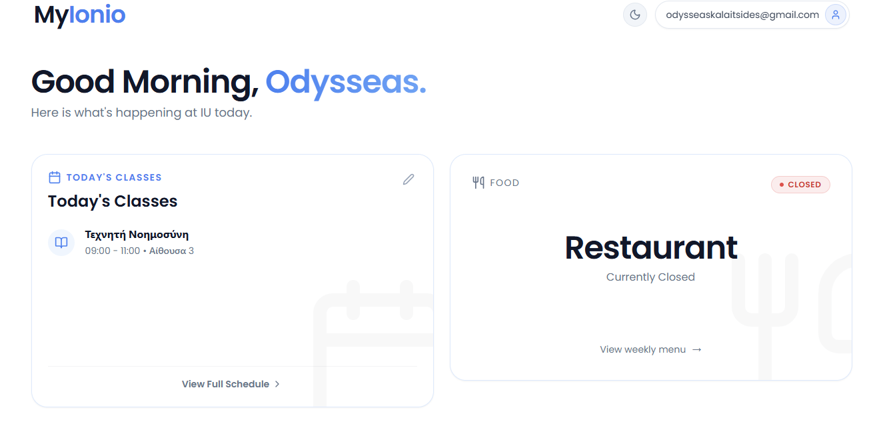
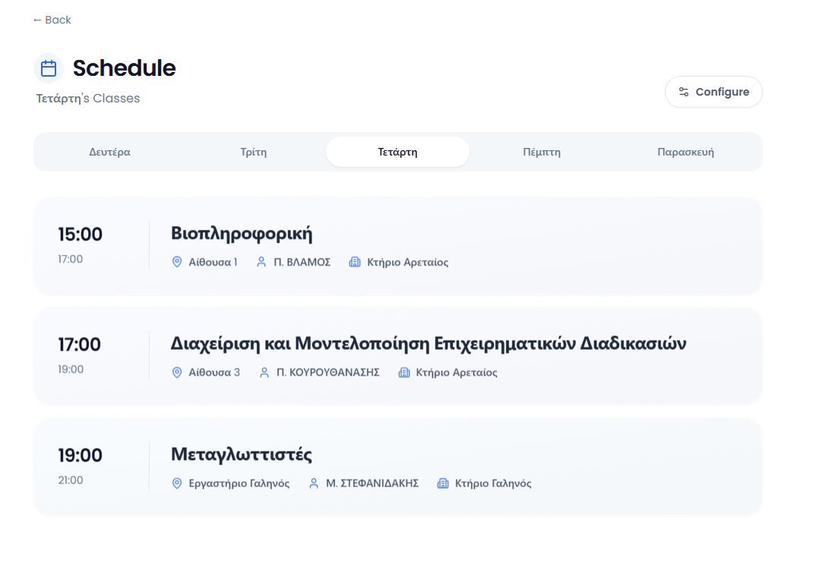
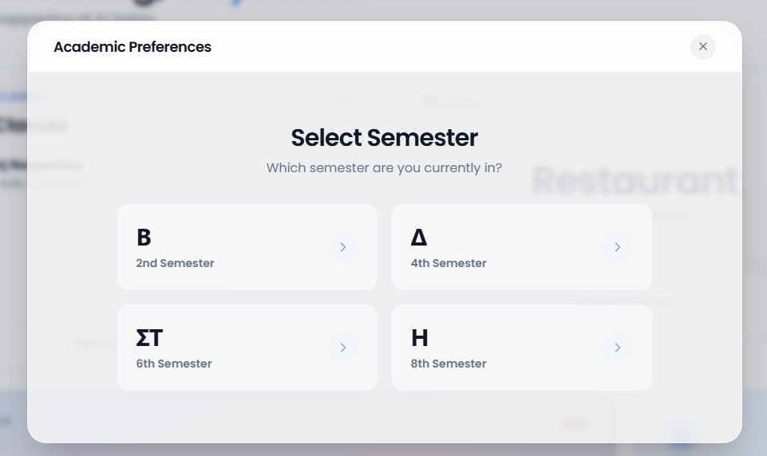
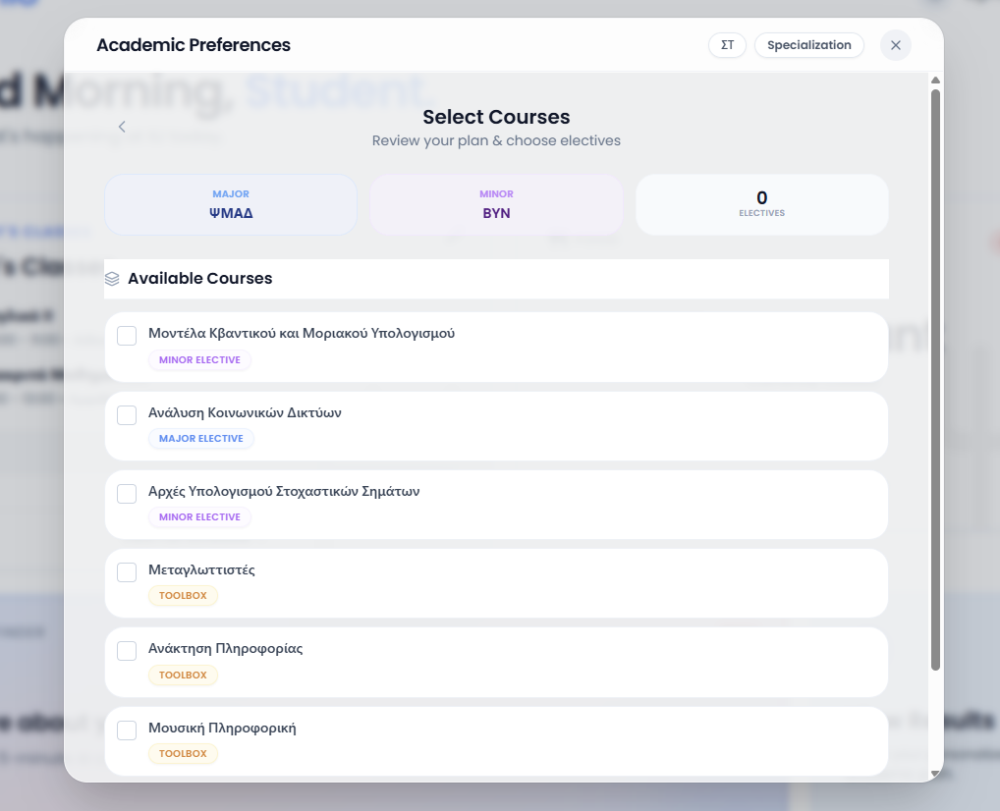
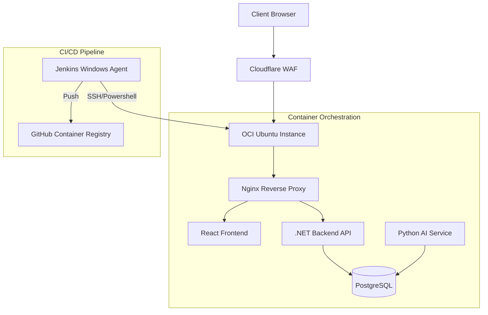

# MyIonio Monorepo

MyIonio is a focused student companion for Ionian University. It keeps the cafeteria menu, professor schedules, academic-direction evaluation, course reviews, and essential university links in one place.

## Preview

<p align="center">
  
  
</p>
<p align="center">
  
  
</p>

## Technical Architecture

The system is deployed as a suite of four core services orchestrated via Docker Compose for production and raw Kubernetes manifests for future-state clustering.

- **Frontend**: React 19 (TypeScript) SPA served via Nginx.
- **Backend API**: ASP.NET Core 8.0 Web API implementing RESTful patterns and Entity Framework Core.
- **AI Service**: Python/FastAPI microservice utilizing Large Language Models (LLMs) for unstructured schedule parsing.
- **Persistence**: PostgreSQL relational database with normalized schema design.

### System Infrastructure Diagram


```mermaid
graph TD
    Client[Client Browser] --> CF[Cloudflare WAF]
    CF --> VPS[OCI Ubuntu Instance]
    
    subgraph "Container Orchestration"
        VPS --> Nginx[Nginx Reverse Proxy]
        Nginx --> FE[React Frontend]
        Nginx --> BE[.NET Backend API]
        BE --> DB[(PostgreSQL)]
        AI[Python AI Service] --> DB
    end

    subgraph "CI/CD Pipeline"
        Jenkins[Jenkins Windows Agent] -->|SSH/Powershell| VPS
        Jenkins -->|Push| GHCR[GitHub Container Registry]
    end
```

## DevOps and Continuous Integration

The project utilizes a custom CI/CD pipeline managed by a native Windows Jenkins instance, ensuring environment parity and automated quality control.

### Pipeline Specification
- **Quality Gates**: Mandatory parallel stages for dependency security scanning (`npm audit`, `dotnet list package --vulnerable`) and unit test execution.
- **Containerization**: Multi-stage Docker builds optimized for minimal image footprint.
- **Deployment Strategy**: 
    - Automated SSH orchestration using restricted-access private keys.
    - Sequential image pulling to maintain stability on low-resource (1GB RAM) OCI micro-instances.
    - Zero-downtime container replacement via `docker compose up -d --remove-orphans`.

## Infrastructure Management

Infrastructure is managed through a hybrid approach:
- **Production**: Docker Compose on Oracle Cloud Infrastructure (OCI).
- **Future-State Orchestration**: Raw Kubernetes manifests (`/k8s`) covering Deployments, Services, ConfigMaps, and Ingress resources for transition to OCI Container Engine for Kubernetes (OKE).
- **Security**: Network-level hardening via OCI Security Lists and host-level `iptables` management.

## Setup and Deployment

### Local Development
Requires Docker and Docker Compose.

1. Clone the repository.
2. Copy `.env.example` to `.env` and replace every production secret. Keep `GRAFANA_ADMIN_PASSWORD` non-empty.
3. Execute the build and start sequence:
   ```bash
   docker compose up -d --build
   ```
4. Check local readiness:
   ```bash
   docker compose ps
   curl -f http://localhost:8080/health
   curl -f http://localhost:5001/api/health
   ```

### Required production configuration

The VPS must provide `DB_CONNECTION`, `JWT_KEY`, `GOOGLE_CLIENT_ID`, and `GOOGLE_CLIENT_SECRET` through its private `.env` or secret manager. `GEMINI_API_KEY` enables AI document parsing, while `SUPABASE_URL` and `SUPABASE_KEY` enable the legacy menu persistence path; the services start with those optional integrations disabled when they are absent. `GRAFANA_ADMIN_PASSWORD` is required when the monitoring profile is deployed.

The frontend includes a lightweight installability baseline (`manifest.webmanifest`, service worker shell cache, and `/health`). The service worker is intentionally network-first and does not cache API responses or private student data.

### Repository Structure
- `/Backend`: .NET 8 Web API source code.
- `/Frontend`: React 19 / TypeScript source code.
- `/MyIonio-AI`: Python FastAPI document-ingestion service.
- `/k8s`: Kubernetes production manifests.
- `/infra`: Jenkins configurations and environment scripts.

## License
Distributed under the MIT License.
