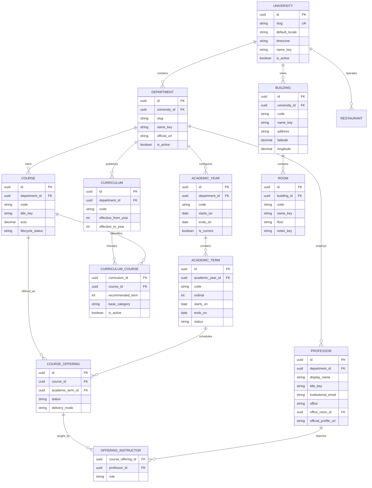
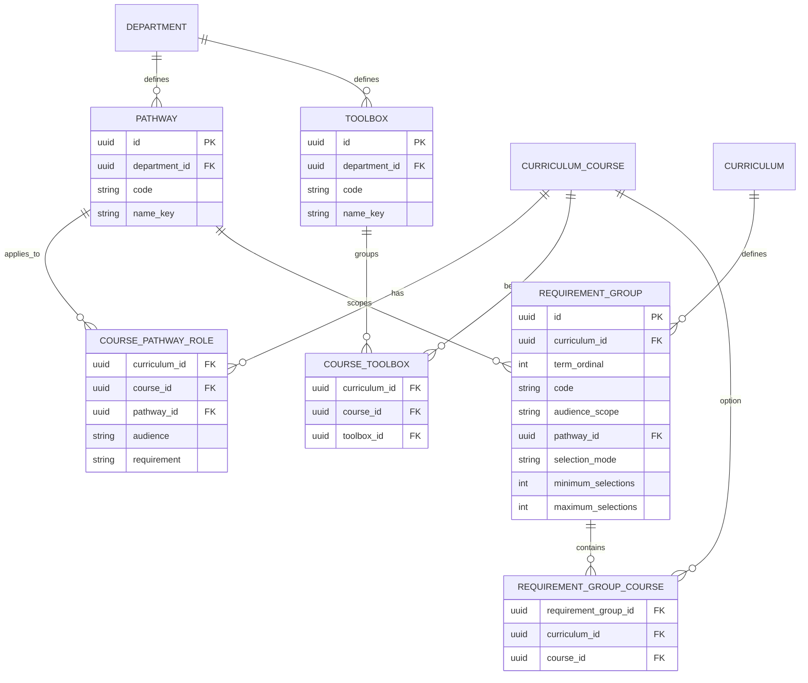
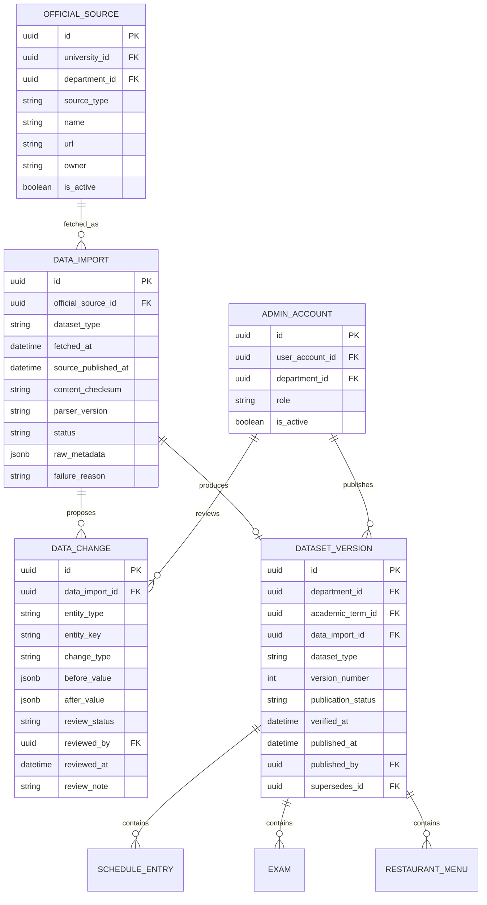
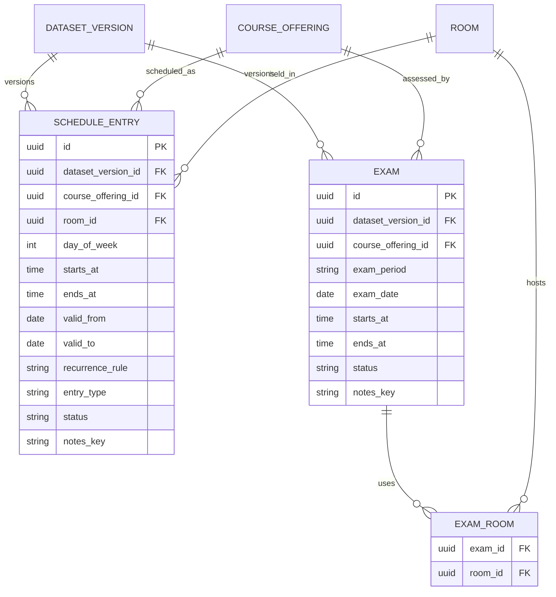
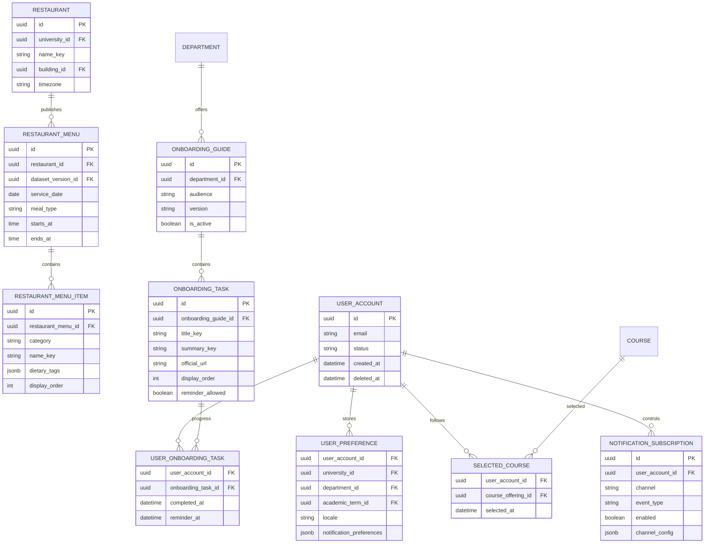

# StudentOS Target Schema

Status: proposed for senior review. This document defines the target domain and
database shape; it does not authorize a destructive migration.

## Design goals

- Support many universities and departments while seeding Ionian Informatics as
  the first tenant.
- Keep stable academic concepts separate from semester-specific teaching data.
- Preserve every published timetable, exam schedule, and catalog revision.
- Make official source, import, verification, and publication state visible.
- Let public academic information work without an account.
- Keep anonymous preferences in validated browser storage; accounts add optional
  synchronization and notifications.
- Prefer one PostgreSQL-backed modular monolith. The ingestion service proposes
  changes through a private API and does not publish directly to the database.

## 1. Tenant and academic structure



`Course` is the stable catalog concept. `CourseOffering` represents one course
being taught during one academic term. Professor schedules must be derived from
`CourseOffering`, `OfferingInstructor`, and `ScheduleEntry`.

## 2. Curriculum categories and selection rules

The official 2025-2026 programme shows that "elective" is contextual, not an
intrinsic property of `Course`. The API may expose an `effectiveCategory`, but it
must calculate that value for a curriculum, term, major, minor, and student term.

`CurriculumCourse.base_category` describes context-free cases:

```text
CORE_REQUIRED      required for every student in that curriculum and term
GENERAL_ELECTIVE   selectable from a shared elective pool
THESIS             thesis requirement
INTERNSHIP         optional internship governed by separate rules
FREE_ELECTIVE      external-department free elective
CONTEXTUAL         resolved through pathway/toolbox rules
```

Pathway and toolbox assignments are normalized independently:



The official annotations map as follows:

| Official mark | Pathway | Audience | Requirement |
|---|---|---|---|
| `Υ-ΒΥΝ`, `Υ-ΚΔΕ`, `Υ-ΨΜΑΔ` | BYN, KDE, PSMAD | MAJOR | REQUIRED |
| `Ε-ΒΥΝ`, `Ε-ΚΔΕ`, `Ε-ΨΜΑΔ` | BYN, KDE, PSMAD | MAJOR | ELECTIVE |
| `ΜΙΝ-ΒΥΝ`, `ΜΙΝ-ΚΔΕ`, `ΜΙΝ-ΨΜΑΔ` | BYN, KDE, PSMAD | MINOR | REQUIRED |

Toolbox membership is separate from pathway roles. The supplied programme uses
`TB1`, `TB2`, `TB3`, `TB4`, and `TB5`; the model and parser must support all
five. A toolbox course belongs to the term's elective pool unless an explicit
curriculum role says otherwise.

### Verified Informatics rules

| Term | Required selection | Elective selection |
|---|---|---|
| 1-2 | Every listed course is required. | None. |
| 3-4 | Five common courses are required. | Choose exactly 1 of 3 toolbox courses. |
| 5 | Four common courses are required. | Choose exactly 2 of 6 toolbox courses. |
| 6 | Choose different major/minor pathways; take 3 major-required and 2 minor-required courses. | Choose at least 1 from major electives plus the term toolbox pool. |
| 7 | Thesis, 3 major-required, and 1 minor-required course. | Choose at least 1 from major electives plus the term toolbox pool. |
| 8 | Thesis, 2 major-required, and 1 minor-required course. | Choose at least 2 from major electives plus the term toolbox pool. |

The advanced-term elective pools printed in the programme are:

| Term | BYN | KDE | PSMAD |
|---|---:|---:|---:|
| 6 | 1 from 2 pathway + 3 toolbox | 1 from 2 pathway + 3 toolbox | 1 from 1 pathway + 3 toolbox |
| 7 | 1 from 1 pathway + 4 toolbox | 1 from 2 pathway + 4 toolbox | 1 from 2 pathway + 4 toolbox |
| 8 | 2 from 2 pathway + 3 toolbox | 2 from 0 pathway + 3 toolbox | 2 from 2 pathway + 3 toolbox |

Pathway electives are eligible only for that pathway's major. Another pathway's
courses are not eligible except where a course is explicitly marked required for
the selected minor. A course from a later term is not eligible.

`RequirementGroup.selection_mode` is `ALL`, `CHOOSE_EXACTLY`, or
`CHOOSE_AT_LEAST`. Counts belong to versioned curriculum data, not hardcoded C#
or React conditions.

The API computes one contextual result per course:

```text
REQUIRED       must be selected for this student context
ELECTIVE       is in an eligible choice group
NOT_ELIGIBLE   belongs to another pathway or a later term
```

It should also return a `reasonCode`: `CORE_REQUIRED`, `MAJOR_REQUIRED`,
`MINOR_REQUIRED`, `MAJOR_ELECTIVE`, `TOOLBOX_ELECTIVE`, or `LATER_TERM`.

## 3. Sources, imports, review, and publication



Allowed import states:

```text
detected -> parsing -> parsed -> needs_review -> approved -> published
                                              -> rejected
         -> failed
```

Publication invariants:

1. An import cannot publish itself; publication requires an authorized admin.
2. Published dataset versions are immutable.
3. A correction creates a new version whose `supersedes_id` points to the prior
   version.
4. Only one published version is current for each
   `(department, academic_term, dataset_type)` tuple.
5. Rollback changes which immutable version is current; it does not delete data.
6. Every critical API response exposes source URL, version, published time,
   verification time, and publication status.

## 4. Schedule and examinations



Times are stored as local academic times and interpreted using the university's
IANA timezone. The API also returns an ISO-8601 timestamp for client use.

## 5. Restaurant, onboarding, and optional accounts



No account is required for public reads. Anonymous selections use a validated,
versioned browser-storage document with the same stable IDs. If a user later
creates an account, the client explicitly offers to synchronize that state.

## 6. Localization

Entity fields ending in `_key` resolve through translated content rather than
embedding Greek and English variants across application tables.

```text
TRANSLATION {
    key             text
    locale          text       -- el-GR, en-GB
    value           text
    source           text       -- official, editorial, system
    updated_at       timestamptz
    PRIMARY KEY (key, locale)
}
```

For short official names that must retain their original wording, the canonical
value remains available alongside translations.

## 7. Required constraints and indexes

- Unique `University.slug`.
- Unique `(university_id, department.slug)`.
- Unique `(department_id, AcademicYear.code)`.
- Unique `(academic_year_id, AcademicTerm.code)`.
- Unique `(department_id, Course.code)`.
- Unique `(department_id, Pathway.code)` and `(department_id, Toolbox.code)`.
- Unique `(curriculum_id, course_id, pathway_id, audience, requirement)`.
- Unique `(curriculum_id, course_id, toolbox_id)`.
- Check `audience IN ('MAJOR', 'MINOR')` and
  `requirement IN ('REQUIRED', 'ELECTIVE')`.
- Check requirement-group selection counts are non-negative and maximum is not
  below minimum.
- Unique `(course_id, academic_term_id)` for a normal course offering; allow an
  explicit section discriminator if multiple sections are introduced.
- Unique `(building_id, Room.code)`.
- Unique `(official_source_id, content_checksum)` for imports.
- Unique `(department_id, academic_term_id, dataset_type, version_number)`.
- Partial unique index ensuring one current published dataset version per scope.
- Check constraints for `starts_at < ends_at`, valid date ranges, ECTS bounds,
  latitude/longitude bounds, and valid state-machine values.
- Index all foreign keys plus schedule lookup keys
  `(dataset_version_id, day_of_week, starts_at)` and exam lookup keys
  `(dataset_version_id, exam_date, starts_at)`.
- Tenant authorization must be derived server-side through department and
  university relationships, never from a browser-supplied role.

## 8. Legacy-to-target mapping

| Current structure | Target structure | Migration treatment |
|---|---|---|
| `semesters` | `AcademicYear` + `AcademicTerm` | Keep semester code as an import alias; create term IDs scoped to year and department. |
| `course_catalog` | `Course`, `CurriculumCourse`, `CoursePathwayRole`, `CourseToolbox`, `RequirementGroup`, `CourseOffering` | Preserve independent major/minor roles and TB1-TB5 membership; derive contextual required/elective results instead of storing one boolean. |
| `class_schedules.courses` JSONB | `DatasetVersion`, `CourseOffering`, `ScheduleEntry`, `Room` | Parse into staging, validate references, then publish as version 1. |
| `exam_schedules.exams` JSONB | `DatasetVersion`, `Exam`, `ExamRoom` | Preserve each source document as a separate immutable version. |
| `weekly_menus.days` JSONB | `RestaurantMenu`, `RestaurantMenuItem` | Backfill by service date and meal type; attach source/import metadata. |
| professor strings in schedules | `Professor`, `OfferingInstructor` | Normalize cautiously; unresolved names remain staged for review. |
| `Users.EnrolledCourses` / `EnrolledCourseIds` JSONB | `SelectedCourse` | Map only records with an unambiguous course offering. |
| frontend department constants | tenant discovery APIs | Retain only as temporary display aliases during migration. |
| `official_document_imports` | `OfficialSource`, `DataImport` | Import existing URL/hash history and assign parser/source metadata. |

## 9. Additive migration sequence

1. Create the new tables without removing or renaming legacy tables.
2. Seed Ionian University, Informatics, its academic year/terms, sources,
   buildings, and known rooms through normal migration or controlled seed data.
3. Backfill stable courses, pathway roles, TB1-TB5 memberships, term
   requirement groups, then offerings, professors, buildings, and rooms.
4. Convert existing schedule, exam, and menu JSON into staged dataset versions.
5. Generate validation reports for missing courses, ambiguous professors, unknown
   rooms, duplicate events, invalid times, and record-count differences.
6. Review and publish version 1 through the same workflow used by future imports.
7. Add new read APIs and run them in shadow mode against existing endpoints.
8. Compare responses and instrument discrepancies.
9. Switch frontend reads one vertical slice at a time.
10. Stop legacy writes, retain legacy tables for a defined rollback window, and
    remove them only in a later reviewed migration.

## 10. Decisions required before implementation

1. UUID v7 versus database-generated UUID v4 for public identifiers.
2. Whether curricula are scoped by admission cohort, effective academic year, or
   both.
3. Whether multiple sections of the same course offering are needed in the pilot.
4. Who may approve schedule and exam publications and whether two-person review
   is required for critical changes.
5. Freshness thresholds for schedule, exam, restaurant, professor, and room data.
6. Data-retention periods for raw imports, rejected changes, audit events, and
   deleted optional accounts.
7. Whether translations are database-managed or compiled application resources;
   the schema above supports database-managed official/editorial content.

## 11. First implementation slice

The first vertical slice should contain only:

```text
University -> Department -> AcademicYear -> AcademicTerm
Course -> CourseOffering -> OfferingInstructor -> Professor
CurriculumCourse -> CoursePathwayRole / CourseToolbox -> RequirementGroup
Building -> Room
OfficialSource -> DataImport -> DatasetVersion
CourseOffering -> ScheduleEntry
```

It is complete when an anonymous mobile client can select the pilot tenant and
term, select stable course-offering IDs, and display today's and next class with
professor, room, source URL, dataset version, and verification timestamp.
