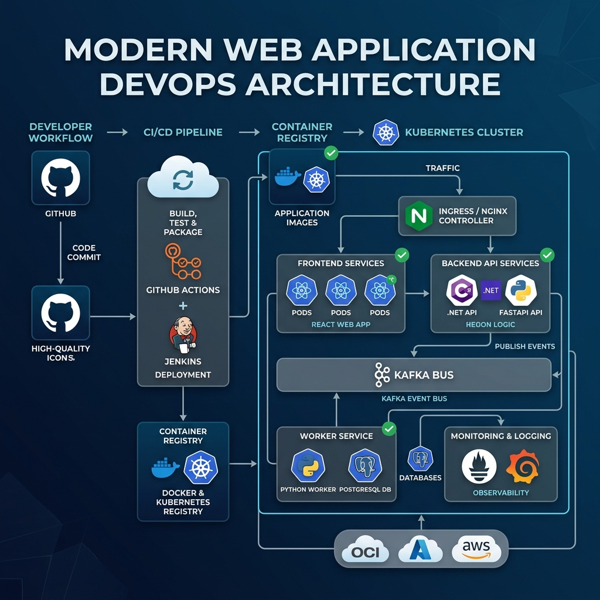

# 🏗️ System Architecture & DevOps Flow

This document provides a detailed overview of the MyIonio monorepo's enterprise-grade architecture. Designed for scalability, resilience, and automated delivery, the system leverages modern cloud-native patterns including container orchestration, event-driven communication, and robust CI/CD pipelines.

## 🧠 Architecture Overview

The following diagram illustrates the end-to-end flow from code commit to production deployment, showcasing the integration between the application layer and the infrastructure layer.



### Visual Flow (High Level)
```text
                ┌────────────────────────────┐
                │        GitHub Repo         │
                │   (Monorepo: frontend +    │
                │    backend + infra)        │
                └────────────┬───────────────┘
                             │
                             ▼
                ┌────────────────────────────┐
                │   CI/CD PIPELINE           │
                │ Jenkins / GitHub Actions   │
                │ - Build                    │
                │ - Test                     │
                │ - Dockerize                │
                │ - Deploy                  │
                └────────────┴───────────────┘
                             │
                             ▼
                ┌────────────────────────────┐
                │   CONTAINER REGISTRY       │
                │ (Docker Hub / OCI Registry) │
                └────────────┬───────────────┘
                             │
                             ▼
────────────────────────────────────────────────────
                ☸ KUBERNETES CLUSTER
────────────────────────────────────────────────────
        ┌────────────────────────────────────┐
        │        INGRESS / NGINX             │
        └──────────────┬─────────────────────┘
                       │
        ┌──────────────┼──────────────────────────┐
        ▼              ▼                          ▼
┌────────────┐  ┌──────────────┐        ┌────────────────┐
│ FRONTEND   │  │ BACKEND API  │        │ WORKER SERVICE │
│ React      │  │ .NET / FastAPI│        │ Python Consumer│
└────────────┘  └──────┬───────┘        └──────┬─────────┘
                       │                       │
                       │                       │
                       ▼                       ▼
              ┌────────────────────────────────────┐
              │            KAFKA BUS              │
              │  (Event-Driven Communication)    │
              └────────────────────────────────────┘
                       │
        ┌──────────────┴──────────────┐
        ▼                             ▼
┌────────────────┐        ┌────────────────────┐
│ PostgreSQL DB  │        │ Logging / Events   │
│ (Persistent)   │        │ Monitoring (logs)  │
└────────────────┘        └────────────────────┘

────────────────────────────────────────────────────
                ☁ CLOUD LAYER (OCI / AWS / Azure)
────────────────────────────────────────────────────
- VM / Compute instances
- Container hosting
- Networking (VPC / subnets)
- Load balancer
```

---

## 🔥 Component Breakdown

### 🧩 1. Monorepo Structure
The project is organized as a monorepo to ensure atomic commits and synchronized versioning across all services.
- `/frontend`: React-based Single Page Application.
- `/backend`: Core business logic powered by .NET and FastAPI.
- `/worker`: Background processors and Kafka consumers for asynchronous tasks.
- `/infra`: Kubernetes manifests, Dockerfiles, and CI/CD configuration.

### ⚙️ 2. CI/CD Pipeline (DevOps Core)
Our automated pipeline triggers on every push to the `main` branch:
1. **Build & Test**: Compiles code and executes unit/integration tests for all services.
2. **Dockerization**: Builds optimized Docker images for Frontend, Backend, and Workers.
3. **Registry Update**: Pushes versioned images to a Container Registry (e.g., Docker Hub or OCI).
4. **Deployment**: Updates the Kubernetes cluster using rolling updates to ensure zero downtime.

### 🐳 3. Containerization (Docker)
Each microservice is independently containerized using multi-stage Docker builds. This ensures:
- **Environment Parity**: Identical behavior across development, staging, and production.
- **Isolation**: Resource limits and security sandboxing for each component.

### ☸ 4. Orchestration (Kubernetes)
Kubernetes manages the lifecycle of our containers, providing:
- **Self-Healing**: Automatic restarts of failed containers.
- **Horizontal Scaling**: Dynamic replica management based on traffic patterns.
- **Service Discovery**: Seamless communication between internal services via ClusterIP.
- **Load Balancing**: Managed traffic distribution via Ingress/Nginx.

### 📡 5. Event-Driven Messaging (Kafka)
Kafka acts as the central nervous system for asynchronous communication:
- **Decoupling**: Services interact via events, reducing direct dependencies.
- **Async Processing**: Long-running tasks (like recommendation engine triggers) are handled by worker services without blocking the API.
- **Scalability**: High-throughput message queuing for analytics and logging.

### ☁ 6. Cloud Abstraction
The architecture is designed to be cloud-agnostic, easily deployable to:
- **OCI (Oracle Cloud Infrastructure)**
- **Azure / AWS / GCP**
- **Hybrid/On-premise Kubernetes**

---

## 🛠️ Operational Guides

### How to Run Locally
Ensure you have Docker and Docker Compose installed:
```bash
docker compose up -d --build
```

### How Deployment Works
Deployments are automated via GitHub Actions. Manual triggers are also available for specific environment promotions.
